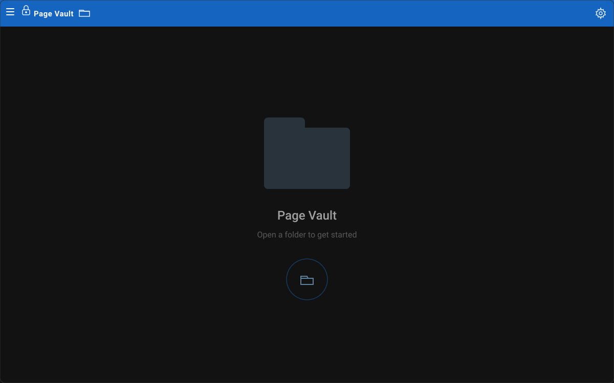
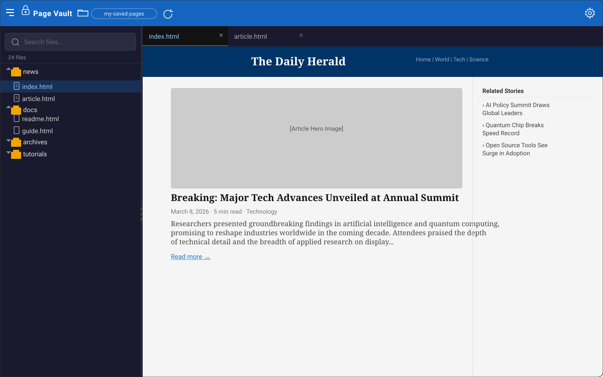
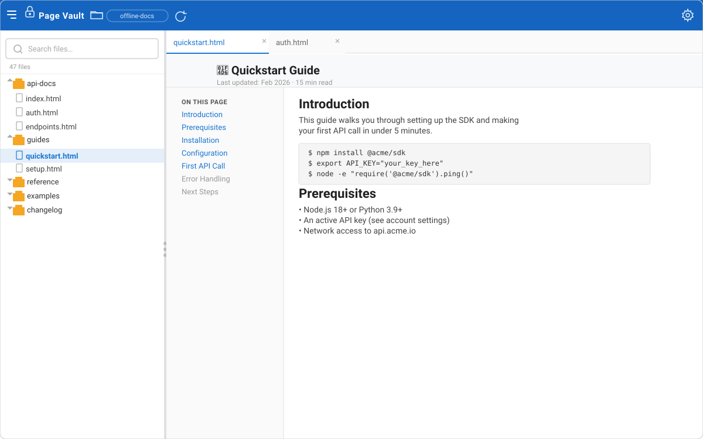
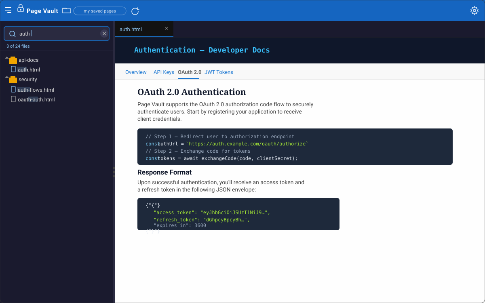

# Page Vault

**Page Vault** is a lightweight desktop application for browsing and previewing HTML pages you've saved for offline reading. Point it at any local folder and it instantly discovers all `*.html` files inside, lets you explore them in a familiar tree view, and renders each page in a sandboxed iframe — no internet connection required.

---

## Screenshots

### Welcome screen


### Browsing files — dark mode


### Browsing files — light mode


### Live file search


---

## What does it do?

You probably save web pages to read later — documentation, news articles, tutorials — but opening them means hunting through your file manager. Page Vault solves that:

1. **Open a folder** — click the folder icon in the top bar and choose any directory on your machine.
2. **Browse the tree** — every `*.html` file is displayed in a nested, collapsible tree that mirrors your folder structure.
3. **Preview instantly** — click any file to open it in a tab. The page renders in a sandboxed iframe exactly as a browser would show it.
4. **Multi-tab workflow** — open several pages side-by-side and switch between them without reloading.
5. **Search/filter** — type in the search box to filter the file list in real time; the tree collapses to only matching files.
6. **Picks up where you left off** — the last folder you opened is remembered across restarts.

---

## Key features

| Feature | Details |
|---|---|
| 🗂 **Recursive HTML discovery** | Scans an entire folder tree and surfaces every `.html` file |
| 🗃 **Tab-based viewer** | Open multiple files simultaneously; each tab is independently sandboxed |
| 🔍 **Live search** | Real-time filter on file names — works across all depths of the tree |
| 🌙 **Dark / Light mode** | Toggle from the Settings dialog; preference is persisted |
| ↔ **Resizable sidebar** | Drag the divider to give more space to the preview |
| 🔒 **Sandboxed preview** | Pages are served through a custom `pagevault://` URI scheme; the iframe uses `sandbox=""` so embedded scripts cannot escape the app |
| 💾 **Session memory** | Last opened folder and theme preference survive app restarts |

---

## Tech stack

| Layer | Technology |
|---|---|
| Desktop shell | [Tauri 2](https://tauri.app/) (Rust + WebView) |
| Frontend | [React 19](https://react.dev/) + [TypeScript](https://www.typescriptlang.org/) |
| UI components | [MUI (Material UI) v7](https://mui.com/) |
| File tree | [MUI X Tree View](https://mui.com/x/react-tree-view/) |
| State management | [Zustand 5](https://zustand-demo.pmnd.rs/) |
| Build tool | [Vite 7](https://vitejs.dev/) |

---

## Prerequisites

Before you can run or build Page Vault, install the following:

- **Node.js 18+** and **npm** — [nodejs.org](https://nodejs.org/)
- **Rust stable toolchain** — [rustup.rs](https://rustup.rs/)
- **Tauri system dependencies** for your operating system — follow the official guide at [tauri.app/start/prerequisites](https://tauri.app/start/prerequisites/)
  - **Linux**: `libwebkit2gtk`, `libssl`, `libayatana-appindicator3`, etc. (exact list on the Tauri docs page)
  - **macOS**: Xcode Command Line Tools
  - **Windows**: Microsoft Visual C++ Build Tools + WebView2

---

## Getting started

```bash
# 1. Clone the repository
git clone https://github.com/sreea05/page-vault.git
cd page-vault

# 2. Install JavaScript dependencies
npm install

# 3. Launch the desktop app in development mode
npm run tauri dev
```

The desktop window will open automatically. Changes to the React source are hot-reloaded without restarting the Tauri process.

---

## Development

### Running only the Vite dev server (UI preview in a browser)

```bash
npm run dev
```

> **Note:** Tauri-specific features (native file dialogs, the `pagevault://` custom protocol) are not available when running in a plain browser. Use `npm run tauri dev` for full functionality.

### Useful commands

| Command | Description |
|---|---|
| `npm run tauri dev` | Start the full desktop app in development mode |
| `npm run dev` | Start the Vite dev server only (UI, no Tauri) |
| `npm run build` | Compile the frontend (TypeScript + Vite) |
| `npm run tauri build` | Bundle the production desktop installer |

---

## Production build

```bash
# Compile frontend assets
npm run build

# Bundle the native desktop installer for your OS
npm run tauri build
```

The finished installer (`.exe`, `.dmg`, `.AppImage`, etc.) is placed in `src-tauri/target/release/bundle/`.

---

## Project structure

```
page-vault/
├── src/                        # React frontend
│   ├── App.tsx                 # Root layout, theme, sidebar resize logic
│   ├── components/
│   │   ├── TopBar.tsx          # App bar: open folder, reload, settings
│   │   ├── Sidebar.tsx         # File tree + search filter
│   │   ├── EditorArea.tsx      # Tab bar + sandboxed iframe viewer
│   │   └── SettingsDialog.tsx  # Dark/light mode toggle
│   └── store/
│       └── useAppStore.ts      # Zustand store (files, tabs, theme, folder)
├── src-tauri/                  # Rust / Tauri backend
│   ├── src/lib.rs              # Custom URI scheme + recursive HTML file discovery
│   └── tauri.conf.json         # Window configuration and bundle settings
├── docs/
│   └── screenshots/            # UI screenshots used in this README
└── index.html                  # Vite entry point
```

---

## Contributing

Contributions are welcome! A few guidelines:

- Keep changes small and focused; one concern per PR.
- For UI changes, use existing [MUI](https://mui.com/) components rather than adding new UI libraries.
- Make sure `npm run build` succeeds before opening a PR.
- Open an issue first for large or architectural changes so we can discuss the approach.

---

## License

See the [`LICENSE`](LICENSE) file for details.
